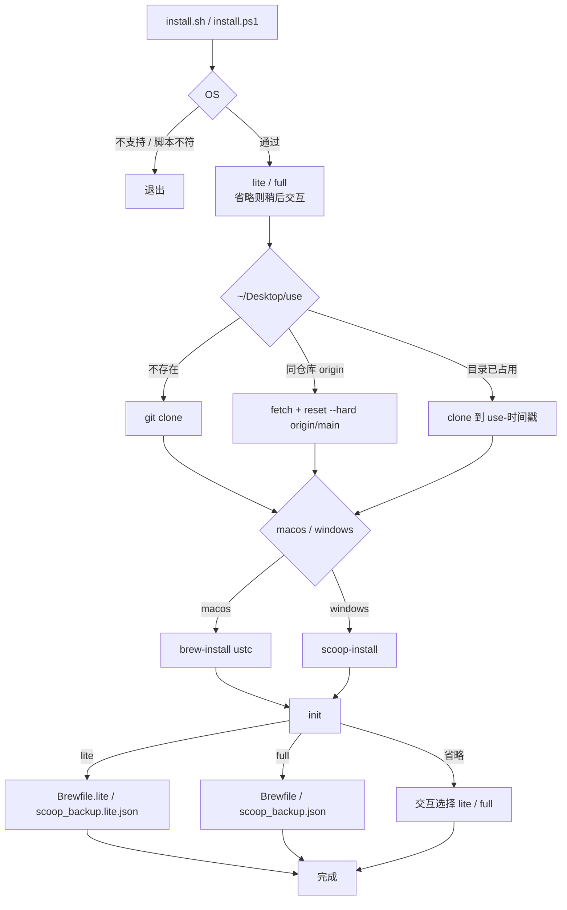
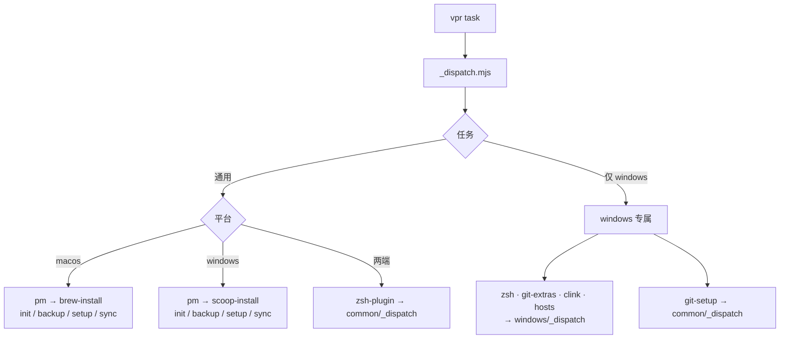
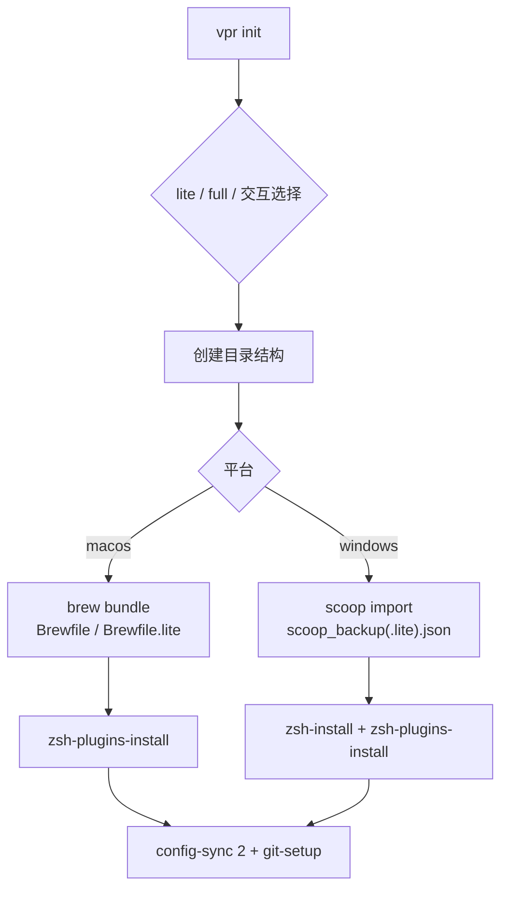
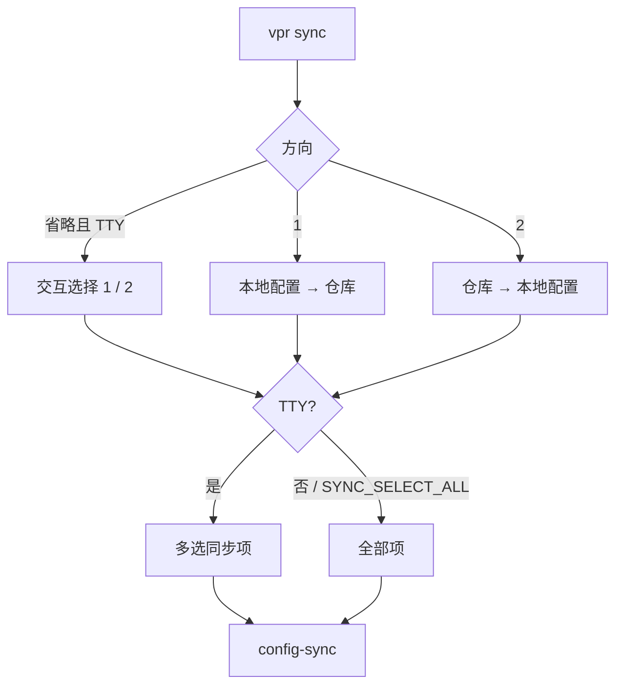

# 个人配置

## 一键安装

### macos · 交互选择

```sh
curl -fsSL https://raw.githubusercontent.com/wwlight/use/main/install.sh | bash
```

### macos · 尝鲜版

```sh
curl -fsSL https://raw.githubusercontent.com/wwlight/use/main/install.sh | bash -s -- lite
```

### macos · 完整版

```sh
curl -fsSL https://raw.githubusercontent.com/wwlight/use/main/install.sh | bash -s -- full
```

### windows · 执行策略

```powershell
Set-ExecutionPolicy -ExecutionPolicy RemoteSigned -Scope CurrentUser
```

### windows · 交互选择

```powershell
irm https://raw.githubusercontent.com/wwlight/use/main/install.ps1 | iex
```

### windows · 尝鲜版

```powershell
$env:USE_PROFILE='lite'; irm https://raw.githubusercontent.com/wwlight/use/main/install.ps1 | iex
```

### windows · 完整版

```powershell
$env:USE_PROFILE='full'; irm https://raw.githubusercontent.com/wwlight/use/main/install.ps1 | iex
```


## 安装 [vite.plus](https://viteplus.dev/)

### macos

```sh
curl -fsSL https://vite.plus | bash
```

### windows

```sh
irm https://vite.plus/ps1 | iex
```


## 通用命令

```sh
vpr pm                            # 安装包管理器（brew / scoop）
vpr pm -- ustc                    # macos 镜像：official | ustc | tuna
vpr init                          # 初始化
vpr init -- lite                  # 尝鲜版
vpr init -- full                  # 完整版
vpr backup                        # 备份已装软件到仓库
vpr setup                         # 从仓库恢复完整软件清单
vpr sync                          # 交互选择同步方向
vpr sync 1                        # 本地配置 → 仓库
vpr sync 2                        # 仓库 → 本地配置
vpr zsh-plugin                    # 安装/更新 zsh 插件
```

> [!WARNING]
> zip 下载解压后需先解除脚本封锁

```powershell
Get-ChildItem scripts,configs -Recurse -Include *.ps1,*.psm1 | Unblock-File
```


## macos

```sh
vpr pm                            # 官方源（默认）
vpr pm -- ustc                    # 中科大镜像
vpr pm -- tuna                    # 清华镜像
vpr init                          # 初始化
vpr init -- lite                  # 尝鲜版
```

```text
configs/macos/
|-- Brewfile                      # Homebrew 应用备份
|-- Brewfile.lite                 # 尝鲜版最小依赖
|-- .zshrc                        # zsh 平台配置
|-- .bashrc                       # bash 配置
|-- utils.zsh                     # zsh 自定义函数
`-- ghostty_config                # Ghostty 终端配置
```


## windows

```sh
vpr hosts                         # 更新 GitHub hosts（需管理员）
vpr pm                            # 安装 scoop
vpr init                          # 初始化
vpr init -- lite                  # 尝鲜版
```

### windows 专属命令

```sh
vpr zsh                           # 安装 zsh 到 git
vpr git-setup                     # Git 全局配置
vpr git-extras                    # 安装 git-extras
vpr clink                         # 安装 clink 插件（cmd 扩展）
```

```text
configs/windows/
|-- scoop_backup.json             # Scoop 应用备份
|-- scoop_backup.lite.json        # 尝鲜版最小依赖
|-- .zshrc                        # zsh 平台配置
|-- .bashrc                       # bash 配置
|-- utils.zsh                     # 自定义函数
|-- aliases.zsh                   # windows 专属别名
|-- pwsh5_profile.ps1             # Windows PowerShell 5 profile
|-- pwsh7_profile.ps1             # PowerShell 7 profile
|-- services-manifest.json        # scoop services 服务注册配置
|-- scoop_services.zsh            # 扩展 scoop services（WinSW）
`-- starship.lua                  # cmd 下 clink + starship
```

### scoop services

需先 `scoop install winsw-pre`，并配置 `services-manifest.json`。

```sh
scoop services help
scoop services ls                 # 列出已管理服务
scoop services install nginx      # 注册并启动
scoop services uninstall nginx    # 注销服务
scoop services start nginx        # 启动
scoop services stop nginx         # 停止
scoop services restart nginx      # 重启
scoop uninstall nginx             # 自动注销服务后卸载
```

### clink

```sh
clink info
clink autorun install -- --quiet  # 启用自动运行
clink autorun uninstall           # 禁用自动运行
clink inject                      # 临时运行
scoop hold clink                  # 禁止更新
```


## common 配置

```text
configs/common/
|-- .zshrc_core                   # macos / windows 公共核心 zsh
|-- aliases.zsh                   # 公共别名
|-- _eza                          # eza 补全
|-- starship.toml                 # starship 配置
|-- opencode.jsonc                # OpenCode 配置
`-- mihomo.yaml                   # Mihomo 配置
```

## 脚本逻辑

### 一键安装

`install.sh` / `install.ps1`：判 OS → 读 lite/full → 落盘仓库 → 装包管理器 → `init`。



### vpr 分发

`vpr <task>` → `scripts/_dispatch.mjs` 按平台转发。



### init

`vpr init [-- lite|full]`：建目录 → 装软件 → zsh 插件 → 配置同步。



### sync

`vpr sync [1|2]`：选方向 →（TTY 下可多选文件）→ 拷贝。


